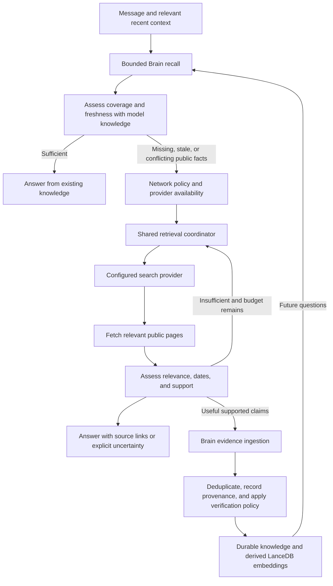

# Online lookup: audit and proposed architecture

Date: 2026-09-10. Status: proposal; implementation unchanged.

## Goal

Novi should first use what it already knows: relevant Brain knowledge and memory, supplemented by the model's trained knowledge. When that is insufficient or stale, look online, answer from relevant evidence, and retain useful supported facts through the Brain so later questions can be answered locally. Retrieve only the minimum sufficient context. Preserve honest uncertainty when evidence is missing, stale, contradictory, or unavailable. A short factual lookup should not require a research workflow or a different model.

## Existing foundation

Novi already has a provider-independent WebSearchService, Brave and SearXNG adapters, connector configuration and health states, web tools, a fetch/rank/merge pipeline, source selection, retrieval budgets, recovery logic, and trace events. Reuse these. No new provider, browser automation dependency, or agent framework is necessary for the first version.

Current flow: heuristic workload router → workload-derived evidence → grounding decision → retrieval plan → pre-loop retrieval → capability binding → model/tool loop and recovery.

The memory design follows Novi's existing [knowledge architecture contract](knowledge-architecture-contract.md) and the layered-memory influences recorded in [brain-evolution.md](brain-evolution.md#5-tencentdb-agent-memory--influences-adopted-and-rejected). Use Novi's implementation of those ideas, including Brain, LanceDB, scenario context, provenance, and reflection; do not introduce a second memory system or assume an external Tencent service is needed.

## Findings

1. **High: freshness depends on workload classification.** `orchestrator/router.py::_detect_workload` does not recognize the supplied alive-status question as research. `orchestrator/evidence.py::detect_from_workload` gives ordinary chat no external requirement and zero confidence. `orchestrator/orchestrator.py::_resolve_grounding` skips the grounding judge at zero confidence. `capabilities/builtin.py` excludes web tools from conversation. This source-level path explains the observed tool list; the original run trace was not inspected, so it is not a confirmed diagnosis of that particular session.

2. **High: irrelevant local evidence can stop recovery.** `runtime/retrieval.py::recommend_after_tool` escalates only for blank output or the exact “No matching knowledge found” text. The knowledge-then-web execution branch marks any nonempty knowledge text sufficient and returns. Neither condition establishes whether the question was answered or whether the evidence is current. The no-tool final-answer recovery also exits when no grounding quality was recorded.

3. **High: web relevance includes the query being evaluated.** `runtime/evidence.py::_merge` writes `Query: {query}` into merged evidence. `runtime/retrieval.py::execute_search` computes lexical relevance over that entire string. Query terms therefore match their own header even if the sources are irrelevant. Evaluate source content only; lexical overlap must not be treated as factual support.

4. **Medium: metadata and error semantics are inconsistent.** `search/models.py` has `published_at`, but the simple web tool omits it and reports only the search time. The merged evidence also omits publication timestamps. Search time is not publication time. `tools/web_search.py` returns failure strings such as “Web search failed”; `runtime/tool_executor.py` generally recognizes success by absence of an `Error:` prefix, with special timeout/permission normalization. Several provider failures can consequently be recorded as successful tool calls.

5. **Medium: budgets and retries have multiple owners.** The collector can fetch three pages and the retrieval executor can reformulate before the coordinator is prepared. The loop then advertises one search and one fetch. The coordinator's approximate duplicate test can also suppress materially different follow-up searches about the same entity. Account for all requests in one place, including pre-loop work and retries.

6. **Medium: fetching has duplicated behavior and incomplete deadline control.** `fetch_url`, `web_fetch`, `webfetch`, and the pipeline overlap. The pipeline accepts a timeout but does not pass it into its trafilatura fetch; thread completion has no overall deadline. This is a latency risk, not proof of the example's 91.85-second cause. Model inference and search timing need separate measurements.

7. **Before expanding automatic fetching: define the trust boundary.** The inspected URL fetch paths accept arbitrary URLs and read full responses before truncating returned text. Pre-loop collection calls the web source directly rather than the tool executor's permission gate. Search evidence is placed inside the system prompt. Automatic lookup must apply the same network policy to pre-loop and model-initiated requests, restrict public-page fetching, cap transferred bytes, validate redirects, and treat page content as untrusted data. This is a focused architectural observation, not a full security audit.

8. **Preserve uncertainty explicitly.** `runtime/runtime.py::_system_prompt` suggests relying on internal knowledge after failed/empty search. For a current-status question, that fallback needs to prohibit presenting stale recollection as current confirmation.

9. **High for automatic learning: explicit learning is not evidence ingestion.** `Brain.learn` calls `KnowledgeLayer.write`, which creates a verified item immediately. `_source_kind_for` maps unrecognized sources to `explicit`; passing a URL does not by itself establish external provenance. Add a Brain-owned evidence ingestion contract rather than feeding arbitrary web text into this explicit-learning path.

10. **Existing recall and consolidation gates need claim-aware checks.** `LayeredRetrievalResolver` uses best similarity to decide whether to expand; this is useful for candidate selection but does not prove answer coverage or temporal validity. `verification.find_near_duplicate` and `corroboration` use word overlap, which can confuse opposite claims or different dates/values. `KnowledgeLayer.store_extracted` updates `last_seen_at` for a matching claim; this is not external re-verification. The existing KnowledgeItem lacks dedicated external verification/validity timestamps. Extend these semantics before automatically reusing learned web facts.

## Options

| Approach | Benefit | Limitation |
| --- | --- | --- |
| Expose web tools to chat and adjust prompts | Smallest change | Still depends on the model realizing it needs evidence and making real tool calls |
| Knowledge-first sufficiency decision, web fallback, and Brain learning (recommended) | Reuses prior learning, bounds context, and centralizes verification | Integrates recall with evidence ingestion and freshness handling |
| Route all factual questions to research | Reuses the research workflow | Adds unnecessary latency and couples information needs to task complexity |

## Recommended flow

### Decision contract

Extend task evidence analysis with a source requirement (`none`, `local`, or `public`), freshness requirement, explicit refresh flag, and a sufficiency outcome (`sufficient`, `missing`, `stale`, `conflicting`, or `uncertain`). Include a reason, supporting memory IDs, uncovered claims, and a resolved public query when necessary. Public information can already exist in Brain memory; requiring public evidence does not itself require a new network call. Workload continues to select execution strategy, independently of this decision.

Explicit online/refresh requests trigger a new lookup when permitted. Current-status questions require sufficiently fresh external evidence, which may be reused from Brain when its validity policy permits. Missing stable public facts also trigger lookup; this feature is not limited to news or changing information. Use compact deterministic rules for unambiguous instructions and a bounded structured decision from the existing primary model for ambiguous factual questions. Avoid a new specialist model and a growing keyword dictionary. Define validation and failure behavior rather than silently treating malformed output as “no lookup.” Expose search tools to chat as a secondary path when network policy permits.

The model's trained knowledge is parametric: it can propose an answer, but there is no searchable inventory of its weights and no reliable “I know this” flag. Stable, low-risk explanations may use it without external verification. Uncertainty, contradictions, freshness requirements, consequential claims, or a request for sources require supporting evidence. Model confidence alone must not satisfy those requirements or promote generated text into verified memory. Do not spend an additional model call just to restate known context when the decision can be made in the ordinary reasoning step.

Resolve follow-ups such as “is he still alive?” using recent conversation context. Send only the minimum public query, not the conversation, private knowledge snippets, or workspace contents. An explicit offline instruction prevents requests. Network-disabled or unavailable states remain visible and cannot be overridden by a model decision.

### Knowledge-first recall and context efficiency

Use `Brain.recall` and the existing `LayeredRetrievalResolver`: consult scenario-scoped knowledge, expand to global knowledge only as needed, and retrieve conversation evidence when useful. Apply entity/project/scenario scope, semantic and keyword matching, status filters, deduplication, and bounded relationship expansion. General public facts should remain discoverable across scenarios without being classified as personal identity; private/project records retain their scope.

Keep the resolver's similarity gate for retrieval expansion, then apply a separate answer-sufficiency gate to the selected records: do they support the requested claims, have acceptable provenance/status, remain temporally valid, and lack unresolved contradiction? A topically similar summary is not enough. Freshness is an eligibility requirement for changeable claims, not a replacement for Novi's existing importance/confidence ranking.

Feed only ranked atomic facts and compact supporting excerpts into the existing context budget, with source IDs and validity metadata. Start from existing top-k limits and token allocation, expand only when a specific information gap remains, and never scan/load all knowledge into the model prompt. Read larger source records on demand. Skip unnecessary recall for noninformational turns. Indexing and bounded consolidation occur outside answer-context assembly.

### Learning through the existing Brain

Add a Brain-owned `ingest_evidence` operation (proposed API name) backed by the existing KnowledgeLayer, stores, markdown synchronization, and reasoning modules. The web pipeline supplies structured claims and source records; it does not write LanceDB or Markdown directly. Preserve `Brain.learn` for its existing explicit-learning semantics.

1. Extract compact, reusable atomic facts that actually supported the answer. Retain source URLs, bounded evidence excerpts, publication/retrieval dates, and query/turn provenance. Keep failed extraction, unrelated results, page instructions, and unsupported model assertions out of reusable verified knowledge.
2. Resolve the entity and claim, including negation, values, and time scope. Look up bounded duplicate candidates with the existing indexes; compare meaning before merging. Reusing a fact or repeating the assistant's own answer must not count as independent corroboration. Retain links back to the original external source through conversation extraction to prevent double-counting.
3. Store eligible new external claims with `source_kind=external` and candidate status, then apply a documented evidence-based promotion policy using the existing candidate/corroborated/verified lifecycle. A strong primary source may justify verification for a straightforward stable fact; disputed or consequential claims require stronger corroboration. Unsupported or conflicted candidates cannot become authoritative solely through repeated exposure. Public-fact verification must not use personal-preference confirmation phrases from page text.
4. Store contradictions with `conflicts_with`; only supersede an older claim when correction or temporal change is established. Preserve original provenance/history. Do not merge “is” and “is not” or facts for different dates merely because their embeddings or words are similar.
5. Persist through the canonical Brain writer, synchronize the human-readable representation, and incrementally embed only added/changed content through the existing EmbeddingService and LanceDB stores. Ensure new validity/provenance fields survive serialization, Markdown synchronization, migrations, and index rebuilds.
6. Make eligible newly acquired knowledge discoverable for the next turn, with a durable mutation result. Answer quality must not depend on storage success: report retention failure separately without discarding a valid sourced answer or claiming the fact was saved. Use idempotent ingestion keyed by claim/source version so retries do not create duplicates. Run broader consolidation through existing bounded reflection triggers; no new autonomous research daemon.

Learning is enabled by this requested design, subject to existing memory settings and explicit “do not remember” instructions. Retain useful public knowledge as general knowledge, not as user preferences. Prefer atomic facts and bounded evidence over embedding every fetched page. Apply existing decay and supersession mechanisms to retrieval eligibility; keep audit history out of routine context.

### Freshness and reuse

Extend external knowledge metadata with `verified_at`, an optional `valid_as_of`/event time, a volatility class, and optional `recheck_after`, plus structured source references. `last_seen_at` remains observation/access history and must never reset external validity merely because the fact was recalled. Legacy items lacking these fields are not silently treated as freshly verified.

| Knowledge type | Repeat-question behavior |
| --- | --- |
| Supported stable fact or dated historical event | Answer from Brain with retained provenance; refresh if challenged, conflicted, or explicitly requested |
| Changeable status, such as a current role or availability | Reuse only within a claim-appropriate verification window; otherwise revalidate |
| Live fact, such as a current price or weather | Refresh for a live request; old values can answer explicitly historical questions |
| Unsupported model recollection or weak/conflicted candidate | Seek evidence when required; do not treat storage as validation |

Freshness windows should be explicit policy settings tested with a controlled clock, not one global TTL for all knowledge. A recalled “alive as of date X” cannot establish present status indefinitely. A well-supported dated event can be reusable historical knowledge. These are claim-level distinctions, not hard-coded answers about a specific person. When offline, give a clearly dated remembered answer where useful and disclose that current status could not be revalidated.

### Retrieval and evidence

Use one coordinator and one provider service for pre-loop and tool-driven lookup. Keep Brave/SearXNG selection unchanged. Put shared permission, budget, cancellation, and deadline checks ahead of outbound I/O. Consolidate fetch implementations behind a common reader while preserving compatibility aliases internally; present one search and one read tool to the model.

Return structured status (`ok`, `no_results`, `not_configured`, `denied`, `failed`) plus evidence quality and source records. Each source should preserve ID, title, URL, publisher/domain, publication date when available, retrieval timestamp, snippet/body, and fetch outcome. Do not invent missing dates. Separate operational success from adequacy of evidence.

Start with a proposed total budget of two searches and three page reads for a short lookup, including pre-loop work, with a configurable overall deadline. Permit one purposeful query refinement if sources do not answer the question. Deduplicate identical requests including filters; avoid blocking refinements solely because entity words overlap. Stop on cancellation, denial, deadline, exhausted budget, or adequate evidence.

Assess whether sources address the entity and specific claim, not merely whether text exists. Check publication/event dates separately from retrieval time. Seek independent corroboration for consequential or disputed status claims; multiple pages repeating one report do not establish independence. When sources conflict, retain that conflict and communicate uncertainty. Local memory can resolve context but cannot establish current public status merely by matching a query.

### Answer and UI

Give the model compact evidence as untrusted source data, with an instruction that page text cannot authorize tool actions or change policy. Require source links for factual claims established by lookup. Validate cited URLs/IDs against actual retrieved records; this verifies provenance, not truth, so evidence sufficiency remains a separate check.

Show real execution events: recalling knowledge, searching, reading, retaining supported knowledge, completion, or a specific failure. A model saying it searched or remembered must not create a success indicator. Reuse the existing activity UI initially. For unavailable evidence, say what could not be verified and why. Do not infer a current status from stale internal knowledge. Retained public facts remain general Brain knowledge, distinct from personal identity. A cached answer can cite its original sources without suggesting they were opened again this turn.

## Delivery sequence

1. Add regressions for the supplied two-turn exchange, pronoun follow-ups, irrelevant nonempty local results, and source-only relevance scoring. Fix the relevance calculation and structured failure propagation.
2. Separate evidence requirements from workload; integrate bounded Brain recall and answer sufficiency, with web fallback for missing or stale public facts. Preserve offline intent and existing permission decisions.
3. Unify coordination and fetching: enforce total budgets, deadlines, cancellation, byte limits, public URL checks, and redirect validation across both entry paths.
4. Add external provenance/validity metadata and Brain evidence ingestion, claim-aware deduplication, verification, supersession, and incremental indexing. Test persistence/rebuild compatibility and immediate next-turn recall before enabling automatic retention.
5. Carry source dates/provenance to synthesis and UI; add citation checks, contradictory-evidence handling, and honest unavailable/save-failed states.
6. Evaluate first-time lookup and repeated-question reuse with the user's configured small model. Measure recall, decision, network, generation, ingestion latency, prompt tokens, web requests avoided, and incorrect reuse. Tune from these results rather than attributing delay to the model or search without evidence.

## Acceptance checks

- “Who is Charlie Kirk?” followed by “Is he still alive?” resolves the same entity and performs an actual provider request when enabled if existing knowledge lacks valid evidence; fixture evidence, not a hard-coded real-world answer, determines the response.
- Equivalent current-status phrasings and explicit “look online” work without selecting research mode.
- Stable explanations, personal-memory questions, and explicit offline requests do not automatically disclose data through search.
- Unrelated nonempty local results cannot satisfy a current-public requirement.
- Query text and prompt headers cannot inflate source relevance.
- Provider outage, missing configuration, denial, no results, unreadable pages, and conflicting reports preserve distinct, honest outcomes.
- All outbound retrieval counts toward the same budget; useful refinements remain possible; stop/deadline prevents further requests.
- Page instructions cannot authorize actions; private/local URLs and unsafe redirects are rejected for public-page reads.
- Citations refer to actual retrieved or retained sources, dates retain their meaning, and only eligible supported claims enter reusable Brain knowledge through evidence ingestion.
- First ask an unknown stable fact: lookup supplies the answer and ingestion records supported knowledge. Ask again in a new conversation/restarted process: Brain retrieves it within scope and answers with zero new web requests.
- A paraphrase retrieves the same learned claim; unrelated neighboring facts do not satisfy the question. Trained-model knowledge supports stable answers without being mislabeled externally verified.
- Advancing a controlled clock beyond validity triggers revalidation of a changeable claim. Recall alone does not advance `verified_at`; a stable dated fact remains reusable.
- Repeated assistant answers and syndicated copies cannot increase independent corroboration. Negation, changed values, and different time scopes are not collapsed as duplicates.
- Failed writes, interrupted indexing, and retried ingestion preserve honest retention state and avoid duplicate claims; metadata survives rebuild and Markdown round trips.
- On a larger fixture corpus, top-k, relationship expansion, and prompt-token limits hold; the implementation never inserts the full memory corpus into context.
- Disabled memory and “do not remember” prevent new durable knowledge ingestion under the existing retention policy; general public facts do not become personal identity attributes.
- Exercise real model/tool behavior separately from mocked provider and routing tests.

## Audit validation and limitations

Read the current routing, capabilities, retrieval/recovery, provider, fetching, prompt, and tool-result code. Existing unrelated working-tree changes were preserved. No application code or configuration was changed, no provider was contacted, and the example's original runtime trace was unavailable.

Revision: inspected the knowledge architecture contract, Brain evolution notes, `Brain.learn`, KnowledgeLayer extraction/write behavior, typed knowledge records, layered recall, and corroboration/deduplication helpers. This revision adds the user-requested knowledge-first learning cycle and replaces the previous non-retention proposal. References to Tencent influence describe the repository's documented design lineage, not a fresh audit of an external implementation.

Attempted targeted pytest suites: `test_router.py`, `test_retrieval_recovery.py`, `test_web_search.py`, `test_search_honest_state.py`, and `test_retrieval_coordinator.py`. They did not start: the repository virtual environment points to a missing Python 3.12 executable; the Windows Python launcher reports no installed Pythons. No tests are claimed to pass. Runtime behavior, active provider configuration, and model latency remain unverified.
