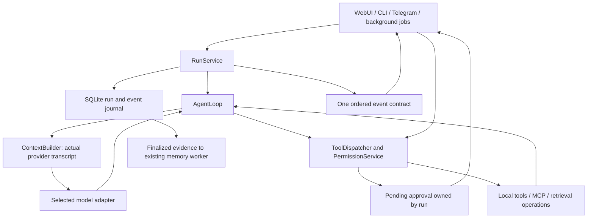

# Novi Agent Runtime Replacement Plan

**Status:** Implemented in the working tree; migration cleanup and full-suite verification are in progress. This document records the original design: the current implementation uses natural provider completion rather than `finish_task`, and explicitly projects journal events to the WebSocket contract. See README.md for the current architecture.

**Goal:** One request creates one durable run that can think, emit several messages, request permissions, execute tools, process results, compact context and finish honestly.

**Architecture:** A single application RunService owns a single AgentLoop and the run state machine. Provider turns, tool results and permission decisions update an authoritative transcript and ordered event journal. Every interface consumes that contract; none implements its own continuation or completion policy.

**Tech stack:** Existing Python, Pydantic/dataclasses, SQLite, LangChain provider adapters, FastAPI/WebSocket, React/TypeScript, pytest and Vitest. No new runtime framework or dependency is proposed. Existing LangGraph research/coding logic may remain only as bounded collaborators; remove the parallel generic RuntimeWorkflowGraph execution owner.

**Audit/design basis:** `docs/architecture/2026-09-16-agent-state-audit.md`, findings A01–A12. This replaces the preservation-first premise in the September 14 AgentRun design. Use the local superpowers executing-plans workflow when implementing, with the repository's solo-engineer adaptations. No mandatory subagents, commits, deployment or repeated design-approval rituals.

## Constraints and decisions

- No compatibility shims, dual event protocols, tuple-like action objects, old-runtime fallback, or silent rerun on TypeError. Backend and frontend cut over together.
- Preserve unrelated working-tree edits, user notes, files and chats. No database deletion or destructive reset is authorized by this plan. A data-format transition, if needed, is a separate explicit backup/conversion operation, not a runtime adapter that lives forever.
- Support one executing foreground run initially. Conversation identity is still explicit; single-flight does not permit history leakage between conversations.
- A message ending does not end the run. Only the run controller makes terminal transitions.
- Cancellation is cancellation. Budget exhaustion is blocked/limited work, not success. Empty output without a valid finish signal is a protocol error.
- All external effects, including retries, configured alternatives, nested web fetches, verification commands and MCP calls, pass one tool gate. No direct function bypass.
- Explicit deny wins over convenience modes and session grants. Skills, model output, memory and fetched text cannot authorize actions.
- Preserve selected primary-model behavior and existing memory inference admission. No model fallback or model-setting change is part of this work.
- Preserve search budgets, evidence/provenance handling, opt-out behavior and useful research/coding functionality from the current uncommitted work.
- Keep private reasoning out of the durable user transcript by default. User-visible progress is authored output, not a reconstruction of hidden reasoning.

## Contract and ownership



Use explicit typed contracts rather than growing `metadata` into the application API:

| Contract | Required content |
|---|---|
| `RunRequest` | conversation ID, original user message ID/text, project/workspace scope, attachments, explicit research selection |
| `RunState` | run ID, status, terminal reason, current turn, transcript, context summary, pending calls/approvals, budget/usage, selected model snapshot |
| `TranscriptMessage` | message ID, role, content blocks, provider call IDs/results, user visibility, source/trust metadata |
| `ModelTurn` | normalized text/reasoning stream, structured calls, provider finish reason, actual reported usage |
| `ToolCall` | call ID, run ID, registered tool identity, validated canonical arguments, effect/scope metadata |
| `ToolResult` | matching call ID; succeeded/failed/denied/cancelled/timed_out; output/artifact refs; structured error; diff; provenance |
| `PermissionRequest` | request/run/call IDs, canonical argument digest, policy version, requested scope/effects, expiry and proposed diff |
| `PermissionDecision` | request ID, allow_once/allow_run_scope/deny/cancel/expired, decision origin, granted scope |
| `RunEvent` | unique event ID, monotonic run sequence, run/conversation IDs, type, timestamp, typed payload |

Run states: `queued → running ↔ awaiting_permission`; internal compaction is activity within the run. Terminals: `completed`, `blocked`, `failed`, `cancelled`, `interrupted`. Persist one terminal transition and a reason. Blocked distinguishes an unresolved prerequisite or exhausted safety budget from engine failure.

Expose `RunService.start(request) -> run_id`, `subscribe(run_id, after_sequence)`, `snapshot(run_id)`, `respond_permission(request_id, decision)` and `cancel(run_id)`. Transport serialization is allowed; semantic translation back to old event names is not.

Canonical events: `run.started`, `run.state_changed`, `message.started`, `message.delta`, `message.completed`, `tool.requested`, `tool.started`, `tool.completed`, `permission.requested`, `permission.resolved`, `context.compacting`, `context.compacted`, `run.completed`, `run.blocked`, `run.failed`, `run.cancelled`, `run.interrupted`. Model/plan/activity metadata may have additional typed payloads, not anonymous positional tuples.

## 1. Establish the run and transcript core

**Files:** replace `novi/runtime/agent_run.py`, `agent_action.py`, `agent_events.py`; create `novi/runtime/transcript.py`, `novi/services/run_store.py`; narrow `novi/runtime/execution_context.py`. Tests: `tests/test_run_contract.py`, `tests/test_run_store.py`.

- [ ] Define strict request/state/event/result types above; remove magic indexing, custom tuple equality, random-ID-insensitive comparison and production `_fake_actions` hooks.
- [ ] Implement atomic event append/state transition in SQLite using the existing storage conventions. Check `(run_id, sequence)` uniqueness and terminal-state guard in the same transaction.
- [ ] Associate existing task/job records with the run ID; make them projections/references rather than alternative lifecycle owners. Store full tool output as bounded artifacts when necessary, keeping references in events.
- [ ] Load conversation messages by conversation ID. Separate intentional long-term recall from this conversation transcript. Do not initialize a new conversation from a socket's last conversation.
- [ ] Test duplicate/late terminal attempts, event replay, A→B→A conversation isolation, durable completed messages, and honest interrupted status after restart. Do not automatically rerun a previously started side-effecting call whose outcome is unknown.

**Deliverable:** an independently testable state machine and transcript store with no model or transport dependency.

## 2. Replace the loop, including progress and finish semantics

**Files:** create `novi/runtime/agent_loop.py`; replace the execution body of `novi/runtime/runtime.py`; retire `novi/runtime/react_attempt.py` once consumers move. Refactor reusable provider preparation out of runtime into `novi/runtime/context_builder.py`. Tests: `tests/test_agent_loop_protocol.py`.

- [ ] Start with scripted provider turns reproducing A01/A02/A04: progress plus two calls, text before calls, empty provider stream, provider error, malformed call, denial, stop during streaming, stop after an effect and before reporting.
- [ ] Implement one loop over an authoritative transcript. Resolve/prepare the model and retrieval context once per run; refresh only for explicit configuration/context needs. Do not restart analysis or remember a new user exchange on every iteration.
- [ ] Normalize provider-native messages, call IDs, finish reasons and usage. Remove parsing arbitrary assistant JSON prose as executable tool calls. Unsupported tool calling must produce an explicit limitation rather than an invented fallback protocol.
- [ ] Implement `report_progress(message)` as a control operation in the normal call batch processor. It emits a separately identified public message and records a matching control-tool result. Execute every other call in the batch in order, unless cancellation requires explicit cancelled results for remaining calls.
- [ ] Implement explicit `finish_task(summary, outcome)` control semantics, with `outcome` completed or blocked. It cannot complete alongside outstanding external calls or unresolved approval requests. A batch mixing finish and external actions returns a validation result requiring the model to process the external results before finishing; it cannot hide dropped actions.
- [ ] Content emitted before tool calls becomes a completed progress message before tool activity. Final summary is one separately identified message. Provider text alone never manufactures a run success after an engine/protocol error.
- [ ] Check cancellation before the provider request, during streaming, before each dispatch and after each result. Record completed effects even when a later cancellation occurs. Do not silently retry failed provider calls after unknown external effects.
- [ ] Count model turns, tool calls, elapsed time and actual provider usage at run level; store unknown usage as unknown. Bound endless progress and repeated failures. Repeat reads/verification when state changed; do not prohibit every identical call forever as the old `seen_calls` set does.
- [ ] Run transcript tests that assert each assistant call has exactly one matching result before the next provider request. Verify exactly one run terminal without mocking the loop/controller.

**Deliverable:** “progress → tool → progress → tool → final” works through the actual loop with a fake provider and fake side-effect functions.

## 3. Replace tool authorization and pending permissions

**Files:** replace policy portions of `novi/runtime/permissions.py`, `tool_executor.py`, `mcp_permissions.py`; create `novi/services/permission_service.py`; extend `tool_registry.py` metadata; replace Session approval state. Tests: `tests/test_tool_authorization.py`, `tests/test_permission_lifecycle.py`.

- [ ] Require a policy service at dispatcher construction; remove default allow-all test dependencies from production constructors.
- [ ] Use this order: registered/exposed tool and argument validation → resource scope/effects → explicit global/project/MCP denial → applicable bounded user grant → mode defaults → pending user approval or headless blocked result.
- [ ] Check the per-run exposed-tool set at execution, not only at model binding. Canonicalize paths and command arguments before deriving a grant; never treat an arbitrary path or shell string as a reusable wildcard pattern.
- [ ] Replace boolean callbacks/private timeout flags with `PermissionDecision`. Require matching request/run/call IDs and the unchanged argument digest. Resolve exactly once; reject late, expired, missing-ID or already-consumed answers.
- [ ] Offer Allow once, Allow this scope for this run, Deny and Stop. Keep grants narrowly tied to tools and resource scope. Persist grants only when the user explicitly edits a persistent setting; no implicit permanent “always allow.”
- [ ] Remove hidden fallback execution. A retry or alternative tool is a new visible call subject to the same gate. Nested search fetches and verification commands must use that boundary too.
- [ ] Separate `tool.requested` (may wait on approval) from `tool.started` (actual execution). Include diff/preview where calculable and a precise terminal status for every call.
- [ ] Verify explicit deny under every supported mode, MCP denial, permission evaluation exception, cancellation while waiting, approval expiration, duplicate answers, changed arguments, sequential same-name calls, configured fallback denial and headless behavior. No test should require a real destructive action.

**Behavioral change:** remove old bypass/accept-edits semantics that override denials. Convenience defaults can suppress unnecessary asks inside an allowed scope; a deny can only be changed through a deliberate policy edit. Explain this in the settings UI and release notes.

**Deliverable:** one enforceable authorization boundary, independently testable before browser integration.

## 4. Make context compaction operate on the real provider input

**Files:** `novi/runtime/context_builder.py`, replace `context_manager.py` internals, adapt `context_budget.py` and `novi/common/execution_state.py`. Tests: `tests/test_agent_context.py`.

- [ ] Budget actual system instructions, tool schemas, skill blocks, conversation/run messages, retrieval evidence, tool results, attachment costs and output reserve for the selected model/configured context.
- [ ] Use provider/tokenizer counts when available; label conservative estimates otherwise. Never count a short surrogate history while sending the full history.
- [ ] Compact completed groups only. Keep the user goal, constraints, meaningful discoveries, explicit failures, completed effects, artifact references, active skill identities, pending approvals and unresolved tasks. Do not break assistant/tool-call pairing.
- [ ] Replace the actual transcript slice used on the next inference. Verify budget reduction before emitting `context.compacted`. If minimum required context does not fit, end blocked with an explanation, without re-running the goal.
- [ ] Test a long run whose important early tool result remains usable after compaction; a call pending approval survives intact; oversized skill/tool inputs cannot bypass accounting; failed compaction is visible; run ID and grant scope remain stable.

**Deliverable:** continuation uses real prior results, and context usage is bounded without resetting the run.

## 5. Replace skill discovery and activation

**Files:** create `novi/skills/catalog.py`, `novi/skills/service.py`; remove `_load_all_skills`, `_scan_skills` and eager support-file injection from runtime; use the service in WebUI skill routes and `SkillsSection.tsx`. Tests: `tests/test_skill_catalog.py`, `tests/test_skill_activation.py`.

- [ ] Define one schema for name, description, body, canonical root and content hash. Use it for create/upload/list/activate. Enforce one name identity instead of divergent folder/frontmatter aliases; support the same name characters everywhere.
- [ ] Validate the full artifact before writing. Surface an invalid skill as an explicit error rather than a successful creation that later vanishes.
- [ ] Supply names/descriptions in the model catalog. `activate_skill(name)` returns the validated instructions and support-file index as an explicit control result; supporting content is read on demand within the skill root.
- [ ] Pin active instructions by hash for the run. Catalog changes become visible to the next run without restarting a socket; deletion cannot cause a mid-run instruction swap.
- [ ] Treat user skill selection as context selection, never tool authorization. Embedded scripts execute only through ordinary authorized tools. Do not scan streamed answer text as a hidden activation channel.
- [ ] Test valid/invalid creation, underscore names, duplicate identity, edits between runs, safe file-root boundaries, large support files, repeat activation and denial of a tool suggested by a skill.

**Deliverable:** predictable skill availability and context use, with no second permission system.

## 6. Cut every execution entry point over to RunService

**Files:** replace lifecycle orchestration in `novi/services/execution.py`; add `novi/services/run_service.py`; update `novi/cli.py`, `novi/services/telegram.py`, `novi/services/background.py`, queue/scheduler callers and `novi/webui_server.py`; retire the general `novi/graphs/runtime_graph.py` owner. Keep reusable research/coding/evidence collaborators under the service.

- [ ] Move task/job/request preparation into one RunService start path. Pass explicit research selection, project, attachments, workspace and model snapshot as typed values.
- [ ] Replace all callers of old `coordinator.run_stream` and direct generic runtime iteration. CLI/Telegram/background render the same events; headless required approval records blocked work rather than pretending approval or waiting on invisible UI.
- [ ] Keep useful research retrieval and coding verification as bounded actions owned by the run. They must return observations/evidence to the loop and use the same dispatcher for effects. Delete graph-specific terminal adapters and duplicated generic reason/act loops.
- [ ] Retain foreground/memory inference coordination across the entire active run. Test cancellation during memory-to-foreground handoff and ensure an interrupted handoff yields cancelled/failed, not completed.
- [ ] Make sockets subscribers rather than execution owners. Disconnect does not erase an active run or its pending decisions. Reconnect supplies an event cursor and run snapshot; a process restart marks non-resumable active work interrupted without replaying uncertain effects.
- [ ] Verify jobs/plan views, explicit research routing and typed events using the real service for every entry point. Ensure one failed call does not produce duplicate terminal events or a second invocation through a TypeError catch.

**Deliverable:** no interface depends on the retired execution protocol. Do not release a split deployment where only the WebUI is migrated.

## 7. Rebuild the chat run projection and permission rendering

**Files:** replace run-event handling in `novi/webui/src/hooks/useNoviChat.ts`; add `src/state/runReducer.ts` and tests; replace run events in `src/services/novi.ts`; update `src/types/index.ts`, `Conversation.tsx`, `AssistantResponse.tsx`, `AssistantArtifacts.tsx`, `ActivityPanel.tsx`, `ThinkingTrace.tsx`, `PermissionPrompt.tsx`.

- [ ] Implement a pure reducer keyed by conversation/run/message/call/request IDs and event sequence. Ignore already-applied events, request recovery for gaps and reject events belonging to another run. Generate TypeScript shapes from the backend schema if possible using existing tools; otherwise enforce schema fixtures in tests.
- [ ] Render an ordered run timeline with independently completed messages and individually tracked tools. Show one run-level working indicator between messages. Tool failure, denial, timeout and cancellation remain distinguishable from success.
- [ ] Put pending approvals in the run's action area, independent of streaming bubbles and message positions. Display exact action/scope, available preview and expiration. Never hide it after progress.
- [ ] Restore terminal cleanup from the terminal run state: close unfinished display messages honestly, settle tool/permission states, clear busy state and persist the terminal projection. Do not append an anonymous error token and leave stale streaming state behind.
- [ ] Rehydrate snapshots/events on reconnect; remove the local “keep owner and hope events resume” behavior and timer-based successful-looking stop cleanup.
- [ ] Preserve reusable typography, markdown, code, attachment and navigation components. Use frontend-design when making the run presentation and webapp-testing for actual browser checks.
- [ ] Test same-name tool calls, progressive bubbles, stale/out-of-order events, errors after progress, switching conversations while active, cancellation while awaiting permission, and reconnect during both streaming and approval.

**Deliverable:** the user can watch and control the same run the backend is executing, including after two or more progress messages.

## 8. Connect long-term memory to finalized run evidence

**Files:** replace `NoviRuntime._remember` call sites with `novi/services/run_memory.py`; adapt `novi/brain/types.py`, `storage/conversation_store.py`, `curation/jobs.py`, `packet.py`, `contracts.py`, `apply.py` only as required by explicit run evidence/scope. Retain the worker, inference coordinator and journal mechanisms that pass their contracts.

- [ ] Persist the user message and public assistant messages once with stable IDs; retain tool result actor/provenance and terminal run outcome. Feed memory permitted finalized run evidence once, not once per loop/compaction.
- [ ] Treat progress, assistant speculation, tool text, denial and errors as distinct evidence classes. Failed/cancelled runs may contain valid user facts, but must not imply successful tool effects. No-retention rules still apply before memory ingestion.
- [ ] Preserve coherence when segmenting sources: include necessary surrounding qualification/correction context and stable evidence coordinates. Never let a byte/character window alone define the semantic scope of a claim.
- [ ] Carry project/global scope as explicit metadata through proposal, validation, storage and recall. Test two projects with conflicting preferences and deliberate global preferences.
- [ ] Keep approved-delta replay, revision checks and preservation of user-authored Markdown. Test cancellation between writes and crash replay with disposable vaults; document the existing external-editor compare-and-swap limitation.
- [ ] Evaluate the selected real model separately on development and held-out episodes. Record unsupported saves, actor/scope mistakes, duplicate memories, useful recall and missed corrections. Report raw counts as well as rates; do not count abstention as useful recall or same-model review as independent verification.

**Deliverable:** agent activity and long-term memory agree about what happened, while durable storage remains intact.

## 9. Delete retired paths and validate the complete cutover

Delete after the corresponding consumers have moved, within the same unreleased implementation series:

| Retired mechanism | Required replacement |
|---|---|
| `AgentAction` tuple/dict emulation; `AgentEvent` tuple equality/indexing | Strict typed contracts |
| `_LOOP_DONE` / `__plan_step_done__` and anonymous event tuples | Explicit model/control outcomes and RunEvent |
| Old coordinator `run_stream` and `_run_with_auto_continue` | Single RunService + AgentLoop |
| Independent generic graph/ReAct lifecycle owners | One agent loop; bounded specialized collaborators |
| `_map_agent_event_to_ws`, `_forward_item`, old token/done/message_start aliases | Canonical event serialization |
| Session `_perm_event`, `_perm_allowed`, callback-private flag inspection | PermissionService requests/decisions |
| Direct configured fallback invocation; optional allow-all policy constructor | Authorized dispatch for every effect |
| Regex activation from generated prose; duplicate skill parsers | Skill catalog/service and activation control |
| Runtime-wide conversation pair history and per-attempt `_remember` | Identified conversation/run transcript and run memory ingestion |
| Production fake-action queues and globally leaking fake coordinator helpers | Scoped provider/tool fixtures exercising production control code |

- [ ] Add integration tests that use the actual RunService, loop, policy, store and event serialization. Fake only the model/network/effect boundary.
- [ ] Exercise in a browser: send a task → progress → tool → progress → permission → allow → tool result → final. Repeat with deny, expiry, stop, provider error, repeated tool names, reconnect and conversation navigation. Confirm messages remain separate and only the final run event clears busy state.
- [ ] Run real selected-model smoke tests with a temporary workspace and disposable memory stores. Verify tool selection, valid call/result pairing, useful progress, result-informed continuation and explicit finish. Do not infer these properties from mocked tests.
- [ ] Run the complete relevant backend and frontend suites, TypeScript/production build, and packaged desktop acceptance for stop/quit/handoff. Verify permission changes in the UI and engine agree.
- [ ] Search production callers for the retired names above; remove dead tests/config/doc promises that require them. Preserve useful behavior tests and update README architecture to the implemented contract.
- [ ] Review the final diff against the original dirty tree. State failures and unverified acceptance checks precisely. No compatibility fallback is the rollback plan: an unreleased cutover remains unreleased until its acceptance checks pass.

**Completion gate:** no observed defect from the audit remains reproducible; every requested tool gets an identified result; every run gets exactly one honest terminal; approvals remain visible and enforceable throughout; conversation/run history survives transport changes; no retired production execution path remains.

## Audit baseline commands and outcomes

Run from repository root with the existing environment. Initial sandbox access failed; approved execution outside that sandbox worked. These are the commands already run for the audit, not a claim that the future implementation is verified.

```powershell
.\venv\Scripts\python.exe -m pytest tests/test_agentrun_lifecycle.py tests/test_agentrun_streaming.py tests/test_agentrun_terminal.py tests/test_webui_agentrun_bridge.py tests/test_emit_progress.py tests/test_memory_correctness.py tests/test_permissions_beta.py tests/test_skills_beta.py -q
# 70 passed, 2 failed; failures recorded in the audit.

.\venv\Scripts\python.exe -m pytest tests/test_memory_curation.py tests/test_memory_draft.py tests/test_memory_worker.py tests/test_memory_inference_coordinator.py tests/test_memory_provider.py tests/test_memory_query_merge.py tests/test_permission_timeout_honest.py tests/test_agent_foundation.py tests/test_agent_run.py tests/test_agent_action.py tests/test_agent_events.py tests/test_agentrun_tokens.py tests/test_coordinator_execute.py -q
# 98 passed.

.\venv\Scripts\python.exe scripts/audit_agent_state.py
# JSON describing reproduced defects; no real tools or model invoked.

# From novi/webui:
npm.cmd test -- --reporter=dot
# 125 passed in 19 files; act warnings.
npm.cmd run build
# TypeScript and Vite passed.
```

Run the new phase-specific tests at each implementation step; run all impacted suites at the cutover. The current audit probe intentionally reports broken behavior and must become replacement acceptance coverage rather than a test that enshrines those defects.
